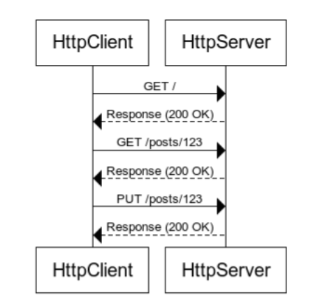
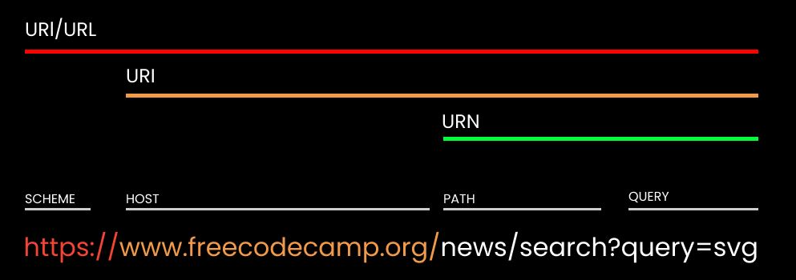

# Web teorija


## OSI (Open Systems Interconnection) model

Računarske mreže su se znatno razvile od razvitka interneta 70ih godina prošlog veka.
Bilo je potrebno razdvojiti širok spektar tehnologija koje su delovale na različite elemente i strukture u računarskim mrežama.
Taj problem je rešen usvajanjem slojevite arhitekture računarskih mreža koji nalaže da su tehnolohije:

1. Svrstavane u slojeve
2. Tehnologije smeju koristiti samo druge tehnologije iz sloja koji je neposredno ispod

Sa ovim pravilima se razvio OSI model koji ima 4 sloja:

1. **Fizički sloj** - bavi se fizičkim aspektima prenosa podataka između dva uređaja poput električnih signala, kablovima, EM zracima, i sl.
2. **Sloj veze** - bavi se kontrolom fizičkog toka podataka između uređaja na istoj lokalnoj mreži. Podaci se organizuju u okvire, vrši se proveravanje grešaka i upravlja pristupom medijumu.
3. **Mrežni sloj** - omogućuje rutiranje podataka između različitih mreža. To uključuje adresiranje, rutiranje i preusmeravanje podataka kroz mrežu
4. **Transportni sloj** - pruža pouzdanu i efikasnu komunikaciju između krajnjih tačaka (npr. klijenta i server ili dva različita računara u P2P mrežama). Brine se o segmentaciji podataka, prenosu i ponovnom sastavljanju paketa na destinaciji. Karakteristicni protokoli su TCP (Transmission Control Protocol) i UDP (User Datagram Protocol) koji omogućuju pouzdan i nepouzdan prenos paketa, respektivno.
5. **Sloj sesije** - omogućuje kreiranje, upravljanje i uništavanje sesija između aplikacija na različitim uređajima
6. **Prezentacioni sloj** - odgovoran je za enkripciju, kompresiju i formatiranje podataka da bi se osigurala kompatibilnost između aplikacija na različitim uređajima i platformama
7. **Aplikativni sloj** - pruža korisničke usluge poput elektronske pošte, FTP (File Transfer Protocol), DNS(Domain Name System), HTTP/HTTPS


## Web

Web predstavlja servis koji je zivi na podskupu interneta i sastoji se od web stranica kojima se moze pristupiti koriscenjem web pretrazivaca.
Postoji dosta servisa i tehnologija koji su integralni za rad web-a:
1. **DNS (Domain Name System)** - Sistem koji povezuje domenska imena i IP adrese
2. **CDN (Content Delivery Network)** - Sistem koji omogucava distribuiranje sadrzaja
3. **HTTP (HyperText Transfer Protocol)** - Protokol koji omogucava komunikaciju između servera i klijenta
4. **HTTPS (HyperText Transfer Protocol Secure)** - Protokol koji omogucava komunikaciju između servera i klijenta koja je enkriptovana
5. **SSL (Secure Socket Layer)** - Protokol koji omogucava sigurnu komunikaciju između dva računara, pogotovu na internetu
6. **TCP (Transmission Control Protocol)** - Protokol koji omogućava **pouzdan** prenos podataka. Kada jedan računar pošalje paket, ovaj protokol garantuje da će paket stići na destinaciju.
7. **UDP (User Datagram Protocol)** - Protokol koji omogućava **nepouzdan** prenos podataka. Kada jedan računar pošalje paket, ovaj protokolne garantuje pristizanje paketa što mu dozvoljava da šalje pakete većom brzinom.
8. **IP (Internet Protocol** - 

### DNS (Domain Name System)

Ima ulogu da poveze domenska imena (npr. www.primer.rs) sa IP adresom (npr. 244.178.44.111).
Funkcionise na sledeci nacin:
1. Klijent salje DNS zahtev DNS serveru da dobije odgovarajucu IP adresu za domen www.primer.rs
2. Ako server koji prima zahtev nema informacije o datom domenu u svom kešu, on šalje rekurzivni upit drugim DNS serverima. Ako ima informacije u kešu, vraća IP adresu klijentu
3. DNS serveri obraćaju se autoritativnim DNS serverima koji su zaduženi za top-level domene (npr. .com, .net, .org, .rs)
4. DNS server vraća IP adresu klijentu

DNS servis se oslanja na prostornu i vremensku lokalnost domenskih imena tj. isti domeni se cesto koriste na istim mestima u isto vreme.

### CDN (Content Delivery Network)

Ove mreže funkcionisu tako što distribuiraju sadržaj putem više servera koji su locirani na različitim geografskim lokacijama, dozvoljavajući korisnicima da pristupe sadržaju koji im je fizički najbliži obezbeđujući najmanju latencu.

Funkcionišu na sledeći način:
1. Kada su web sajt aplikacija su podešeni da koriste CDN, njihovi statički fajlovi (npr. slike, .js, .css, statički .html) se repliciraju i čuvaju na serverima koji su deo CDN-a.
2. Kada klijentska aplikacija pošalje zahtev za resurs, zahtev se prvo šalje DNS serveru da razreši IP adresu za CDN edge server koji je najbliži klijentu.
3. Zatim se klijentov zahtev rutira ka edge serveru koji je odabran, umesto originalnom URL-u iz zahteva.
4. Klijent dobija odgovor tj. traženi sadržaj od edge servera koji mu je najboliži i time se smanjuje latenca.

### HTTP (HyperText Transfer Protocol)

HTTP predstavlja protokol aplikativnog sloja i najkorisceniji protokol na web-u.
Izgrađen je na TCP protokolu i pruža pouzdanu komunikaciju između klijenta i servera.
HTTP je protokol koji nema stanje tj. od dva hronološki susedna zahteva ovaj kasniji ne zna za ovaj prethodni.
Ovo nas tera da gledamo komunikaciju između klijenta i servera kao na seriju zahtev/odgovor ciklusa.

Uzmimo za primer sledeću interakciju klijenta i servera:


1. Klijent salje GET zahtev serveru na osnovnu rutu `/` server-a npr. www.primer.rs
2. Server odgovara odgovorom koji sadrži HTML stranicu.
   1. Klijent salje zahteve za prateće .css i .js fajlove koji su pobrojani u HTML stranici
3. Klijent salje GET zahtev serveru na rutu `/posts/123` recimo klikom na neki link koji vodi na tu rutu
4. Server odgovara odgovorom koji sadrži HTML stranicu sa informacijama o postu
5. Klijent klikne na dugme `Edit` na stranici, menja sadržaj posta i, klikom na dugme `Save` šalje PUT zahtev serveru na rutu `/posts/123`
6. Server odgovara sa odgovorom koji sadrži HTML stranicu sa informacijama o postu, sada sa izmenama

Ovde je ukupno navedeno 3 request/response ciklusa.
Zahtevi ne znaju jedan za drugog.
Svaki ciklus se može opisati kao: Klijent salje **METOD** zahtev na **RUTU** i dobija **ODGOVOR** od servera.

#### Anatomija HTTP zahteva

Svaki HTTP zahtev mora da sadrži:
1. Metod (GET, POST, PUT, DELETE, PATCH, OPTIONS, HEAD, itd.)
2. URL (npr. www.primer.rs/posts/123)
3. Verzija HTTP protpokola (npr. HTTP/1.1, HTTP/2)
4. Zaglavlja _(eng. Headers)_ (npr. Accept, Content-Type, itd.)

Takođe, zahtevi mogu da sadrže i telo _(eng. Request Body)_ koje sadži podatke koje klijent želi da pošalje serveru.

Evo primera jednog HTTP zahteva:
```http
GET /posts/123 HTTP/1.1
Host: www.primer.rs
User-Agent: Mozilla/5.0 (Windows NT 10.0; Win64; x64; rv:94.0) Gecko/20100101 Firefox/94.0
Accept: text/html,application/xhtml+xml,application/xml;q=0.9,image/avif,image/webp,*/*;q=0.8
```

Zakljucujemo da klijent:
1. Salje `GET` zahtev na rutu `/posts/123` protokolom `HTTP/1.1`
2. `Host` heder: Server kome salje zahtev ima domensko ime `www.primer.rs`
3. `User-Agent` heder: Salje sa `Mozilla/5.0` pretraživača sa `Windows 10` OS-a sa `x64` arhitekturom itd.
4. `Accept` heder: Prihvata odgovore tipa `text/html`, `application/xhtml+xml`, `application/xml` itd.

Evo još jednog primera, ovog puta PUT zahteva:
```http
POST /login HTTP/1.1
Host: www.example.com
User-Agent: Mozilla/5.0 (Windows NT 10.0; Win64; x64) AppleWebKit/537.36 (KHTML, like Gecko) Chrome/96.0.4664.110 Safari/537.36
Content-Type: application/x-www-form-urlencoded
Content-Length: 25

username=johndoe&password=123
```

Novi pojmovi:
1. `Content-Type` heder: `application/x-www-form-urlencoded` kaže da se podaci šalju kroz telo zahteva
2. `Content-Length` heder: `25` kaže da je veličina tela 25 bajtova
3. `username` i `password` parametri: `johndoe` i `123` su vrednosti koje klijent upisuje u telo zahteva

Naravno, mogu se slati parametri korišćenjem GET zahteva na sledeći način:
```http
GET /posts?list=newest&limit=10 HTTP/1.1
Host: www.primer.rs
Accept: text/html
```

Treba primetiti da se parametri šalju kroz URL.

Iz tog razloga, pravilo je da se osetljive informacije šalju kroz telo POST zahteva.
Naravno, ukoliko se desi da napadač presretne HTTP zahtev, on će moći da pročita sve, pa čak i telo POST zahteva.
To je mana HTTP protokola.
Ova mana je rešena HTTPS protoklom koji koristi SSL/TLS enkripciju, tako da iako napadač uspešno presretne zahtev, to će njemu izgledati kao nepovezani niz karaktera.

HTTP protokol koristi default-ni port 80, dok HTTPS koristi 443.

#### HTTP metode i status kodovi

##### Metode

- **GET**: Koristi se za zahtevanje podataka sa određenog resursa. Ova metoda ne bi trebalo da ima efekat na podatke na serveru i trebalo bi da bude idempotentna, što znači da više zahteva istog resursa ne bi trebalo da proizvede različite rezultate.
- **POST**: Koristi se za slanje podataka za obradu na određeni resurs. Ova metoda se često koristi za kreiranje novih resursa na serveru, a podaci se šalju u telu zahteva.
- **PUT**: Koristi se za ažuriranje podataka na određenom resursu. Ova metoda obično zamenjuje ceo resurs novim podacima. Ako resurs ne postoji, može biti kreiran novi resurs.
- **DELETE**: Koristi se za brisanje određenog resursa na serveru.
- **PATCH**: Koristi se za primenu delimičnih izmena na resurs. Ova metoda se koristi kada korisnik želi da promeni samo deo resursa, umesto celog resursa.
- **HEAD**: Slično GET metodi, ali vraća samo zaglavlja odgovora bez tela resursa. Koristi se za dobijanje metapodataka o resursu ili provere dostupnosti resursa.
- **OPTIONS**: Koristi se za dobijanje informacija o HTTP metodama koje podržava server za određeni resurs. Ovo se često koristi za "preflight" zahteve pri Cross-Origin Resource Sharing (CORS).
- **TRACE**: Koristi se za testiranje rute zahteva. Server prima TRACE zahtev i vraća ga kao odgovor, omogućavajući klijentu da vidi šta je stiglo do servera i kako je promenjeno tokom puta.
- **CONNECT**: Koristi se za uspostavljanje TCP/IP tunela ka serveru koji je identifikovan od strane resursa. Ova metoda se često koristi za uspostavljanje sigurne veze kroz proxy servere.

##### Status kodovi

| Familija | Opis                     |
| -------- | ------------------------ |
| 1XX      | Informativni odgovori    |
| 2XX      | Uspešni odgovori         |
| 3XX      | Preusmeravajući odgovori |
| 4XX      | Klijentske greške        |
| 5XX      | Serverske greške         |

###### 1XX (Informativni odgovori)

**100 Continue**: Server je primio zahtev i klijent može nastaviti sa slanjem ostatka zahteva.
###### 2XX (Uspešni odgovori)

**200 OK**: Zahtev je uspešno obradjen i server vraća tražene podatke.
**201 Created**: Resurs je uspešno kreiran na serveru.
**204 No Content**: Zahtev je uspešno obradjen, ali server ne vraća nikakav sadržaj kao odgovor.

###### 3XX (Preusmeravajući odgovori)

**301 Moved Permanently**: Resurs je trajno premešten na drugu lokaciju.
**302 Found**: Resurs je privremeno premešten na drugu lokaciju.
**304 Not Modified**: Traženi resurs nije modifikovan od strane klijenta od poslednjeg zahteva.

###### 4XX (Klijentske greške)

**400 Bad Request**: Server nije uspeo da obradi zahtev zbog neispravnog sintaksnog formata ili drugih grešaka u zahtevu koji je poslao klijent.
**401 Unauthorized**: Klijent nije autentifikovan i zahteva autentifikaciju kako bi pristupio resursu.
**404 Not Found**: Traženi resurs nije pronađen na serveru.

###### 5XX (Serverske greške)

**500 Internal Server Error**: Server je naišao na neizvršljivu situaciju koja je uzrokovala grešku u obradi zahteva.
**502 Bad Gateway**: Server koji je delovao kao gateway ili proxy je dobio neispravan odgovor od gornjeg servera.
**503 Service Unavailable**: Server nije trenutno dostupan zbog preopterećenja ili održavanja.

Sledi tabela koja ilustruje koja metoda može da dobije koji odgovor.

| HTTP Method | 200 | 201 | 204 | 400 | 401 | 403 | 404 |
| ----------- | --- | --- | --- | --- | --- | --- | --- |
| GET         | ✓   | ✓   | ✓   | ✓   | ✓   | ✓   | ✓   |
| POST        | ✓   | ✓   | ✓   | ✓   | ✓   | ✓   | ✓   |
| PUT         | ✓   | ✓   | ✓   | ✓   | ✓   | ✓   | ✓   |
| DELETE      | ✓   | ✓   | ✓   | ✓   | ✓   | ✓   | ✓   |
| PATCH       | ✓   | ✓   | ✓   | ✓   | ✓   | ✓   | ✓   |
| OPTIONS     | ✓   | x   | x   | ✓   | ✓   | ✓   | ✓   |
| TRACE       | ✓   | x   | x   | ✓   | ✓   | ✓   | ✓   |
| CONNECT     | ✓   | x   | x   | ✓   | ✓   | ✓   | ✓   |

#### Anatomija URL-a



- `scheme` označava koja će se pravila i protokoli primenjivati tokom komunikacije
- `host` označava IP adresu servera ili domensko ime (Zbog DNS-a ta dva su ekvivalentna)
- `path` označava putanju do resursa 
- `query` označava eventualne parametre u URL-u

**URL (Uniform Resource Locator)** predstavlja sve ove elemente.
**URI (Uniform Resource Identifier)** predstavlja sve ove elemente bez `scheme`.
**URN (Uniform Resource Name)** predstavlja `path` i `query`.


#### HTTP tipovi sadržaja (content types)

Tipovi sadržaja HTTP zahteva:

- **application/json**: JSON formatiran podaci.
```json
{
    "name": "John",
    "age": 30,
    "city": "New York"
}
```

- **application/xml**: XML formatiran podaci.
```xml
<person>
    <name>John</name>
    <age>30</age>
    <city>New York</city>
</person>
```
- **application/x-www-form-urlencoded**: Standardni URL kodirani oblik podataka.
```http
name=John&age=30&city=New%20York
```
- **multipart/form-data**: Podaci se šalju u formi koja omogućava slanje datoteka i drugih binarnih podataka.
```http
POST /upload HTTP/1.1
Host: example.com
Content-Type: multipart/form-data; boundary=----WebKitFormBoundaryabcdefg

------WebKitFormBoundaryabcdefg
Content-Disposition: form-data; name="name"

John
------WebKitFormBoundaryabcdefg
Content-Disposition: form-data; name="age"

30
------WebKitFormBoundaryabcdefg
Content-Disposition: form-data; name="city"

New York
------WebKitFormBoundaryabcdefg
Content-Disposition: form-data; name="file"; filename="example.txt"
Content-Type: text/plain

This is a text file.
------WebKitFormBoundaryabcdefg--
```
- text/plain: Tekstualni podaci.
```txt
name=John
age=30
city=New York
```
Tipovi sadržaja HTTP odgovora:

**application/json**: JSON formatiran podaci.
**application/xml**: XML formatiran podaci.
**text/html**: HTML formatiran podaci.
```html
<!DOCTYPE html>
<html lang="en">
<head>
    <meta charset="UTF-8">
    <title>Success</title>
</head>
<body>
    <h1>Resource created successfully</h1>
</body>
</html>
```
**text/plain**: Tekstualni podaci.

**image/jpeg, image/png**, itd.: Slike u JPEG, PNG i drugim formatima.
**application/pdf**: PDF dokumenti.
**application/octet-stream**: Binarni podaci.
**audio/mpeg**: MP3 audio.

Lista svih tipova može se pronaći na lokaciji https://mimetype.io/all-types.

U ranim fazama web-a, tip svakog serverskog odgovora je bio `text/html`, što znači da bi se stalno ili osvežavala postojeća stranica ili bi se klijent upućivao na neku drugu stranicu.
Ovo je ono što bismo mogli da okarakterišemo kao sinhroni rad klijenta i servera.
Kasnije, kada su se pojavili drugi tipovi sadržaja, klijent bi mogao slati zahtev serveru, a server bi mogao odgovoriti sa `application/json` tipom sadržaja koji bi klijent smestio na odgovarajću lokaciju na stranici. Ovaj režim rada je poznat kao asinhroni i prva njegova implementacija se zvala AJAX (Asynchronous JavaScript and XML), po tome što su jedina dva tipa bili `json` i `xml`.
